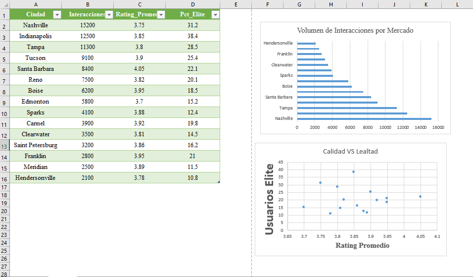

# 📊 Optimización de Engagement Regional - Yelp Dataset

**Rol:** Data Analyst  
**Herramientas:** SQL (SQLite), Excel  
**Objetivo:** Identificar mercados geográficos de alta rentabilidad basándose en la calidad de la audiencia (Usuarios Elite) frente al volumen bruto de interacciones.

## 🚀 Resumen del Proyecto
Análisis de un dataset de más de 3.4 millones de registros para extraer KPIs regionales. Se desmintió la hipótesis de que el volumen masivo garantiza el éxito, descubriendo oportunidades ocultas de inversión mediante el cruce de datos demográficos y calificaciones.

## 🛠️ Desafíos Técnicos Superados
* **Optimización de Big Data:** Implementación de CTEs (Common Table Expressions) y JOINs optimizados para procesar millones de registros sin desbordamiento de memoria.
* **Limpieza de Datos:** Filtrado estratégico de negocios inactivos para asegurar que las métricas reflejen la salud real del mercado actual.

## 📈 Tablero de Resultados (Dashboard)

## 💡 Hallazgos Clave
1. **El Clúster de Éxito:** Se identificó a Indianapolis como el mercado estratégico principal, con una densidad de expertos del 38.4%.
2. **Outlier Orgánico:** Santa Barbara demostró ser líder en satisfacción orgánica (rating de 4.05) con baja dependencia de críticos especializados.
